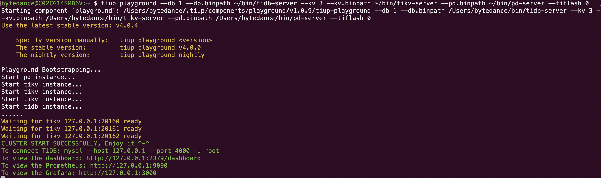
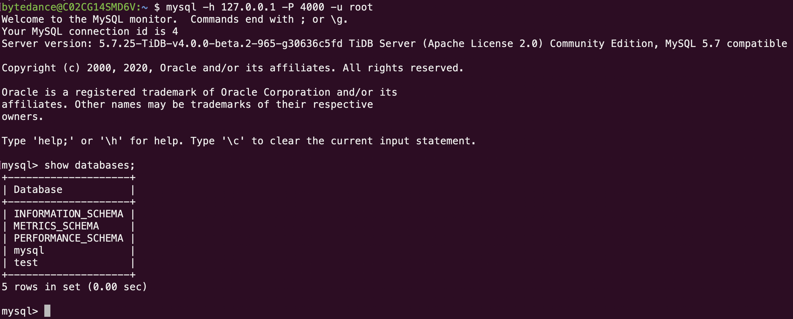
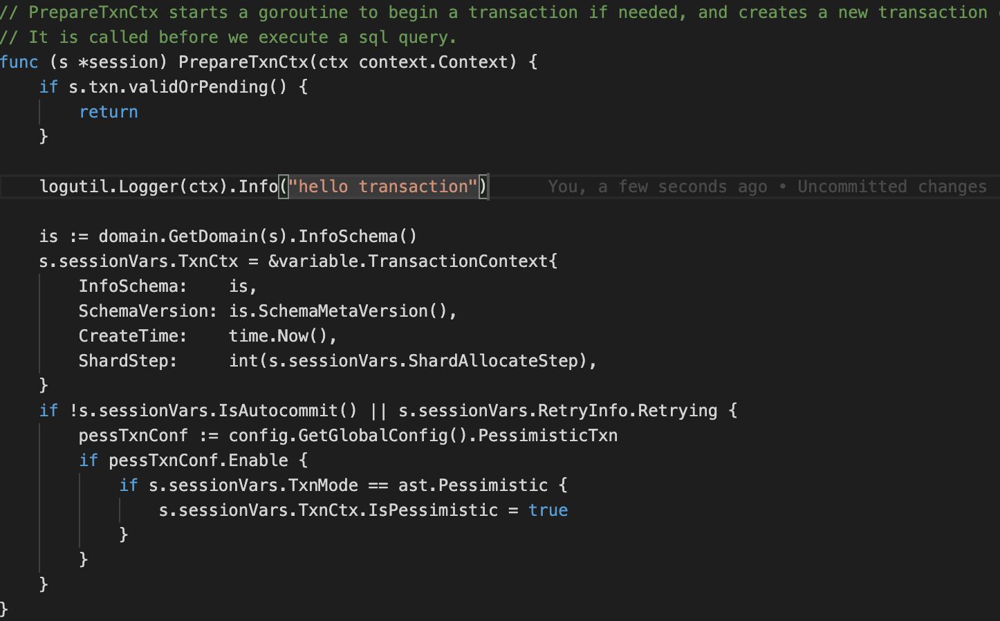

# Lesson1

> 本文本地编译并采用tiup启动TiDB集群，包括3个TiKV，1个1TiDB和1个PD

## 编译

### 获取代码

```sh
# 获取tikv的源码
git clone https://github.com/pingcap/tikv
# 获取tidb的源码
git clone https://github.com/pingcap/tidb
# 获取pb的源码
git clone https://github.com/pingcap/pd
```

### 编译tikv的镜像

在项目根目录下执行`make build`即可编译一个没有优化选项、可调试的tikv版本。

### 编译tidb的镜像

Makefile中编译选项非常多，没有tikv中关于编译选项的概括性描述。根据阅读代码可知，使用`make server`即可编译二进制文件，并可以跳过test等耗时长的步骤。

### 编译pd的镜像

pd中除了pd的可执行程序本身，还包含了很多的辅助性工具。为了方便以后课程，直接`make all`编译所有二进制文件

## 部署

第一步，获取tiup工具。tiup工具用于在操作系统中启动tidb及其生态中的各种服务，每一种服务在tiup中对应一个component，例如`tidb`，`tikv`和`pd`都是一个component。tiup中还有一种特殊的component——`playground`。该component可以用于在一个机器上快速部署一整套的tidb集群，但这种方式仅限于测试。用户可以使用`tiup list`查看所有的component。

```bash
# 安装tiup
curl --proto '=https' --tlsv1.2 -sSf https://tiup-mirrors.pingcap.com/install.sh | sh
```

第二步，安装`playground`组件。tiup

```bash
tiup install playground
```

第二步，使用tiup启动3个kv，1个db和1个pd。注意，这里使用了`--db.binpath`等参数让tiup使用我们自行编译的二进制文件

```bash
tiup playground \
                --db 1 \
                --db.binpath ~/bin/tidb-server \
                --kv 3 \
                --kv.binpath ~/bin/tikv-server \
                --pd.binpath ~/bin/pd-server \
                --tiflash 0
```

tiup启动后的效果如下图所示：


我们可以使用mysql，以空密码的root连接本地的400端口连接tidb，如下图：


## 修改并启动自己的版本

有了tiup工具，我们在编译和测试自己的tidb版本时可以变得非常简单。lesson1中要求我们在修改代码，使得tidb在启动一个事务时，会在日志中打印一个包含“hello transaction”的log。语句的执行显然是与数据库会话绑定在一起的（比如我们通过mysql工具连接数据库后，执行的begin来开启一个事务，其上下文是在一个session中）。通过在`/session`目录下全局搜索不难发现，`Session`的实现中包含一个`PrepareTxnCtx`函数，该函数作为创建事务的准备函数，是启动一个事务必不可少的一步。因此我们选择在该函数中，加入一条log语句，如下图所示：



然后我们尝试通过之前的tiup脚本启动新编译的tidb，但由于tiup不会在控制台中显示日志，我们需要到`~/.tiup/data/<tag>/tidb-0/tidb.log`查看结果，如下图：


这些打印出的日志并非由用户语句触发，而是tidb内部周期性执行的事务触发。