# lesson 2

## 测试环境

### 集群拓扑及配置
本次测试所使用的集群拓扑如下所示：

| ip              | 机器配置          | 集群角色                                         |
| --------------- | ----------------- | ------------------------------------------------ |
| `10.227.71.147` | 8 Cores, 16GB Mem | `grafana`, `alertmanager`, `prometheus`, 1个`pd` |
| `10.227.67.58`  | 8 Cores, 16GB Mem | 1个`tikv`, 1个`tidb`                             |
| `10.227.67.62`  | 8 Cores, 16GB Mem | 1个`tikv`, 1个`tidb`                             |

### 测试环境配置

除了配置好特定角色无密码`sudo`权限，还需要将承载数据和log等目录的磁盘进行格式化并重挂载。磁盘需要被格式化为`ext4`格式，并且添加`nodelalloc`和`noatime`挂载参数。

`nodelalloc`主要是控制当需要写入的数据抵达`kernel page cache`时分配磁盘block的行为。当`nodelalloc`参数被设置时，磁盘block将会在抵达`kernel page cache`时被立刻被分配。因为在一般的操作系统使用场景中，通常是少量数据被以非常高的频率写入，延迟分配将会有效减少分配操作的次数。但在`tinykv`这种单次写入量较大，且需要精确控制`page cache`行为的场景时，手动控制这些细节将会为我们提供更大的优化空间。

### 安装

`tiup`工具为我们提供了一个可以在生产环境下使用的快速部署`tidb`集群的能力，首先我们需要根据集群拓扑定义一个[YAML配置文件](./tidb-test.yaml)，然后利用`tiup`的`cluster`组件完成安装：

```bash
# tiup内建了一个ssh工具，有些情况下这个工具会出现读不到或错误读取本地配置的情况
# 此时可以使用 --native-ssh 选项来使用系统本地的ssh命令来连接远程机器
tiup cluster deploy tidb-test v4.0.0 ${path_to_yaml} -u ${remote_user}
```

安装完成后，我们可以使用`tiup cluster start ${cluster_name}`和`tiup cluster stop ${cluster_name}`来启动和关闭集群，还可以使用`tiup cluster display`来查看集群状态。比如在本次实验中，我们可以看到该拓扑下的集群信息：


## sysbench测试

### 测试步骤

测试使用的config文件在[这里](./sysbench.conf)，为了加快导入速度，我们通过一下命令将tidb的事务模型设置为乐观模型，导入完成之后再将其设置回悲观模型。

```mysql
set global tidb_disable_txn_auto_retry = off;
set global tidb_txn_mode="optimistic";
```

数据导入命令如下：
```bash
sysbench --config-file=./sysbench.conf oltp_point_select --tables=32 --table-size=100000 prepare
```

数据导入过程中（持续时间从5:38~6:00），TiDB的QPS状况如下图：
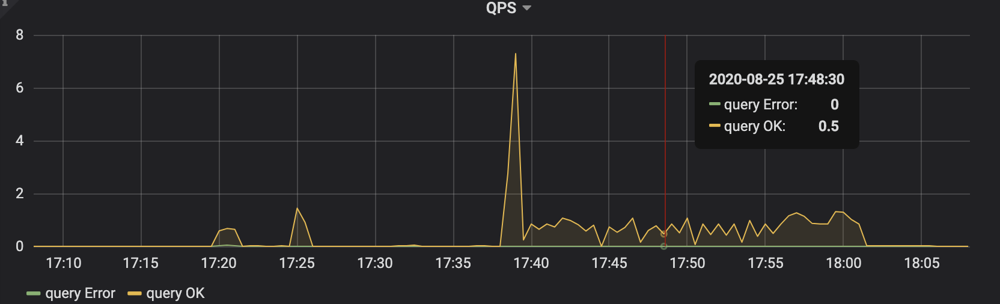
TiDB的查询延迟如下图：
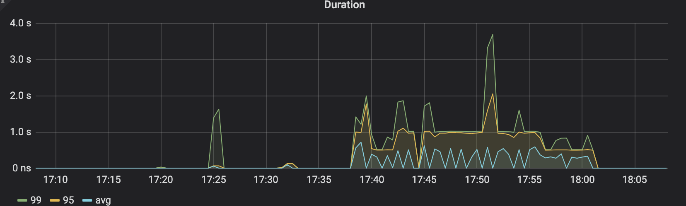
TiKV的cpu使用情况如下图：
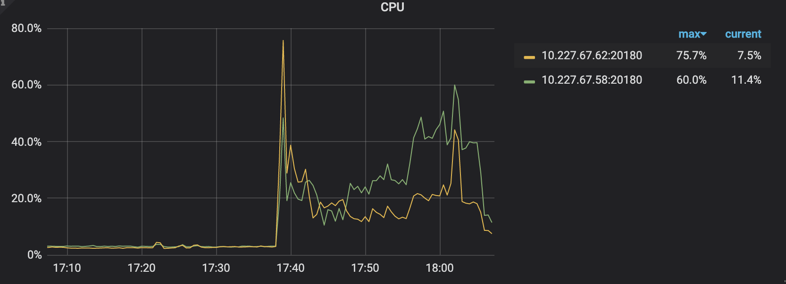
TiKV的qps如下图：
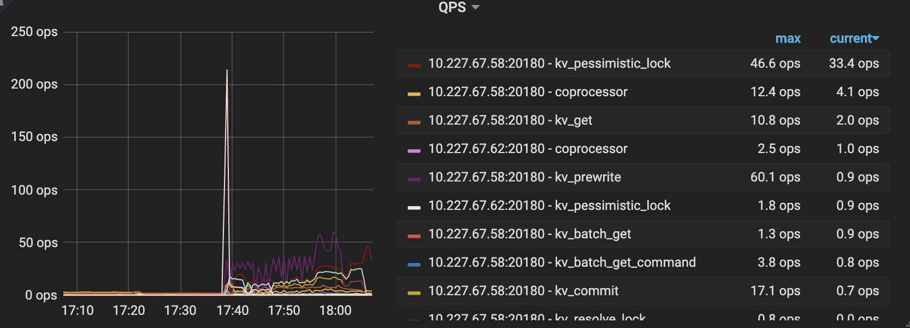
TiKV的grpc延迟如下图：
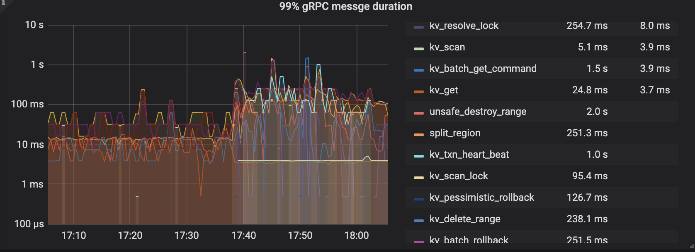
TiKV的grpc qps如下图：
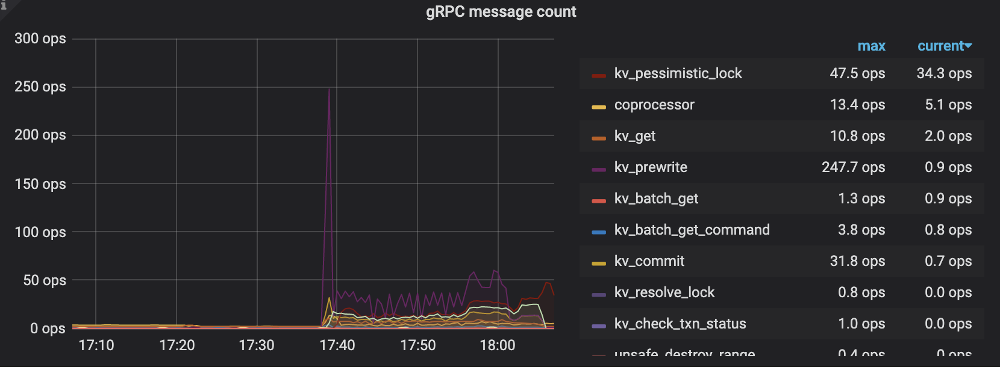

测试命令如下：
```bash
sysbench --config-file=./sysbench.conf oltp_point_select --tables=32 --table-size=100000 run
```

测试过程中，TiDB的QPS状况如下图：
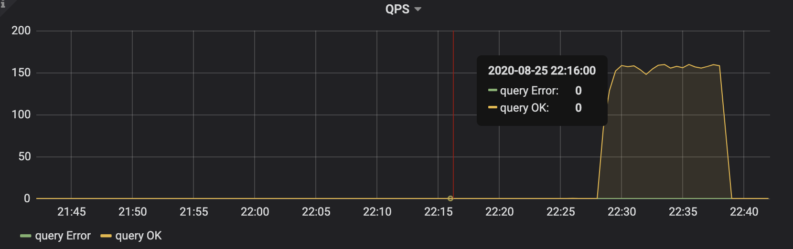
TiDB的查询延迟如下图：
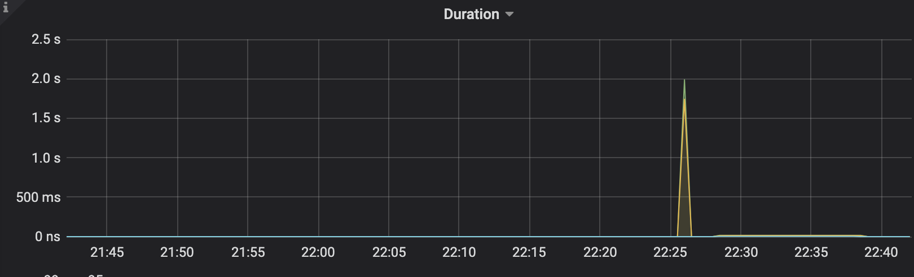
TiKV的cpu使用情况如下图：
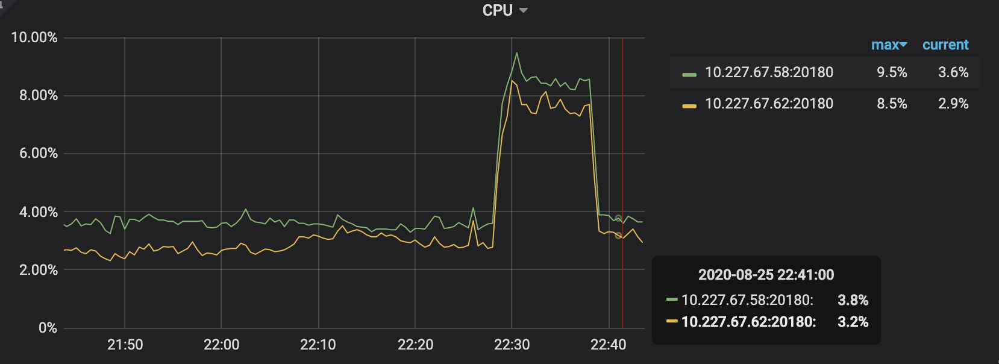
TiKV的qps如下图：
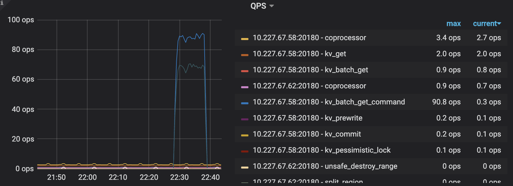
TiKV的grpc延迟如下图：

最终测试结果如下图：
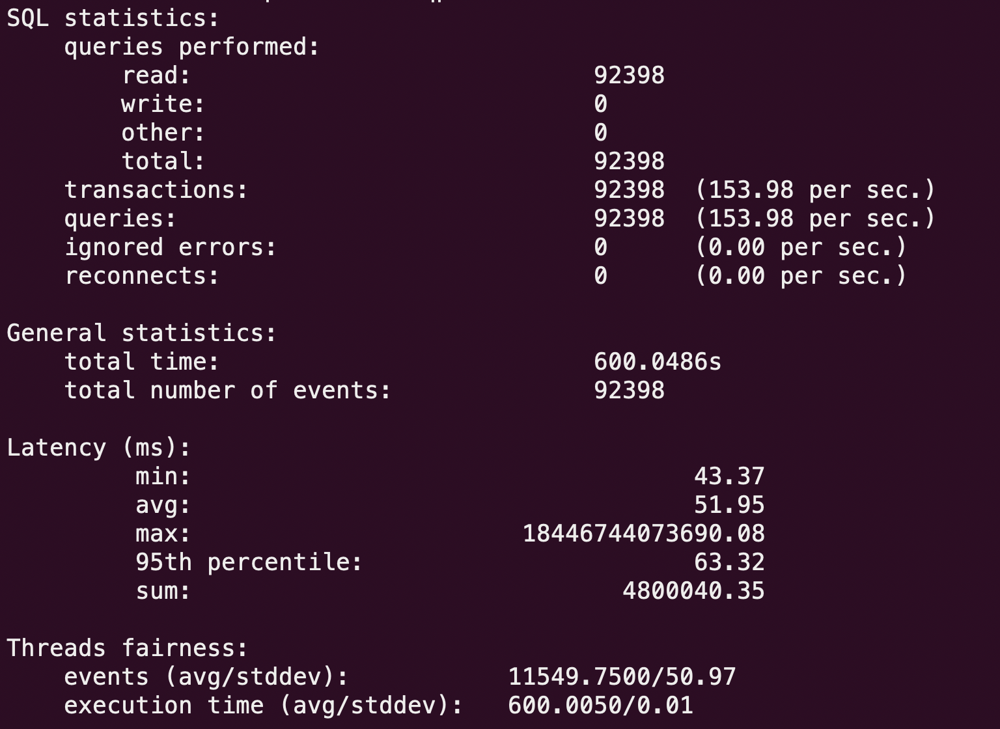

## ycsb测试

数据导入命令如下：
```bash
./bin/go-ycsb load mysql -P workloads/workloada -p recordcount=500000 -p mysql.host=10.227.67.58 -p mysql.port=4000 --threads=8
```

数据导入过程中，TiDB的QPS状况如下图：
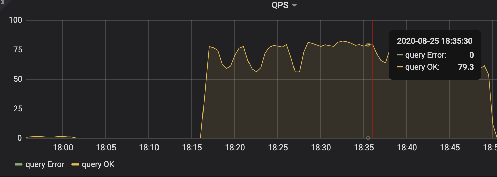
TiDB的查询延迟如下图：
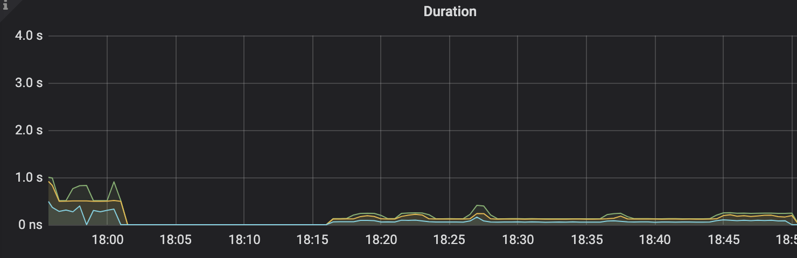
TiKV的cpu使用情况如下图：
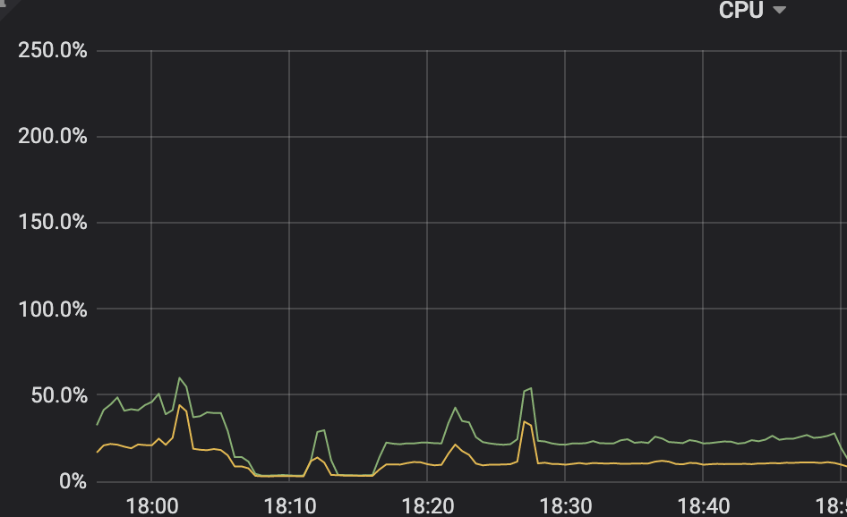
TiKV的qps如下图：
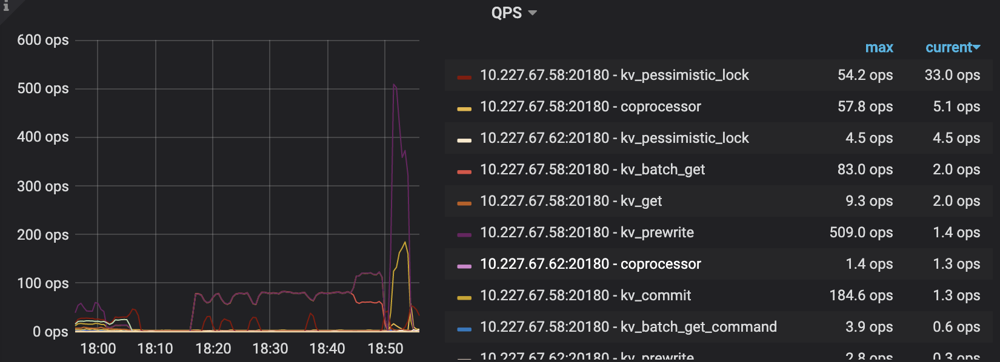
TiKV的grpc延迟如下图：

TiKV的grpc qps如下图：


测试命令如下：
```bash
./bin/go-ycsb run mysql -P workloads/workloada -p recordcount=500000 -p mysql.host=10.227.67.58 -p mysql.port=4000 --threads=8
```

## tpc-c测试

数据导入命令如下：
```bash
go-tpc tpcc -D tpcc -H 10.227.67.58 --warehouses 10 prepare
```

数据导入过程中，TiDB的QPS状况如下图：
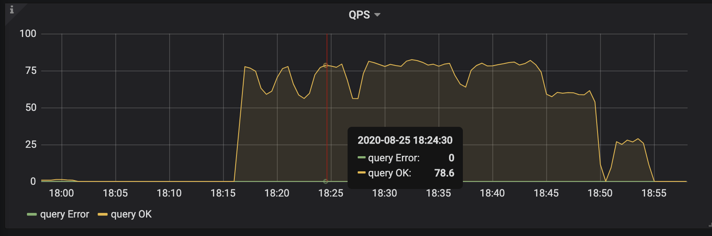
TiDB的查询延迟如下图：
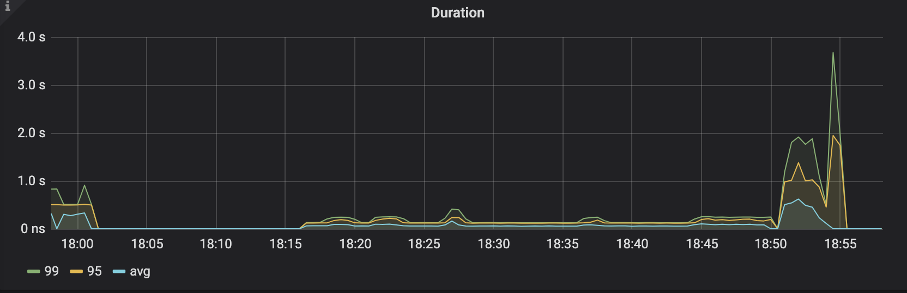
TiKV的cpu使用情况如下图：
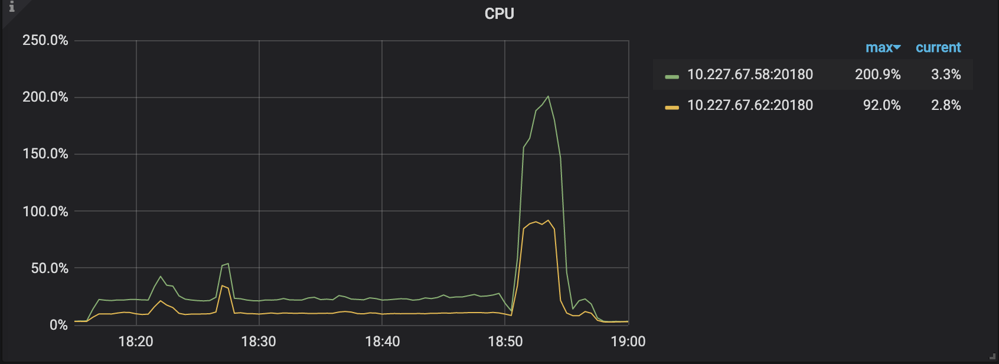
TiKV的qps如下图：
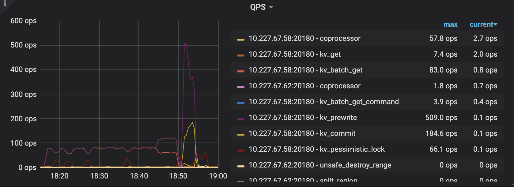
TiKV的grpc延迟如下图：
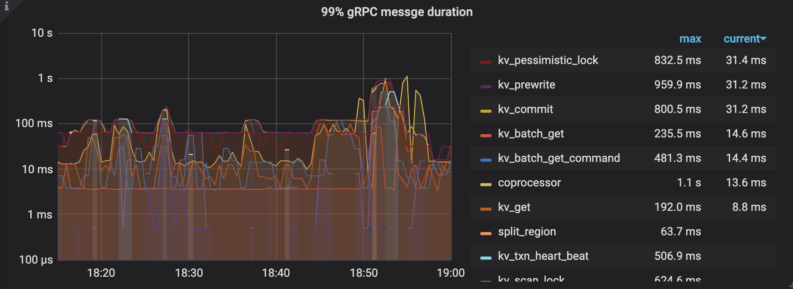
TiKV的grpc qps如下图：
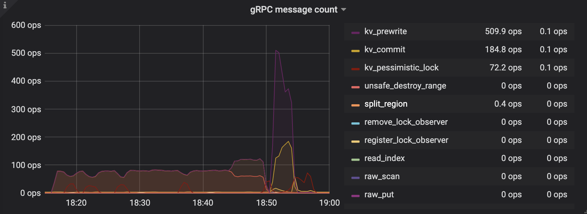

测试命令如下：
```bash
go-tpc tpcc -D tpcc -H 10.227.67.58 --warehouses 10 run
```

数据导入过程中，TiDB的QPS状况如下图：
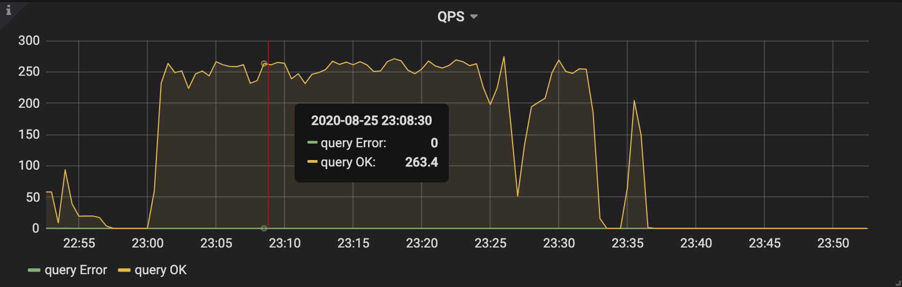
TiDB的查询延迟如下图：
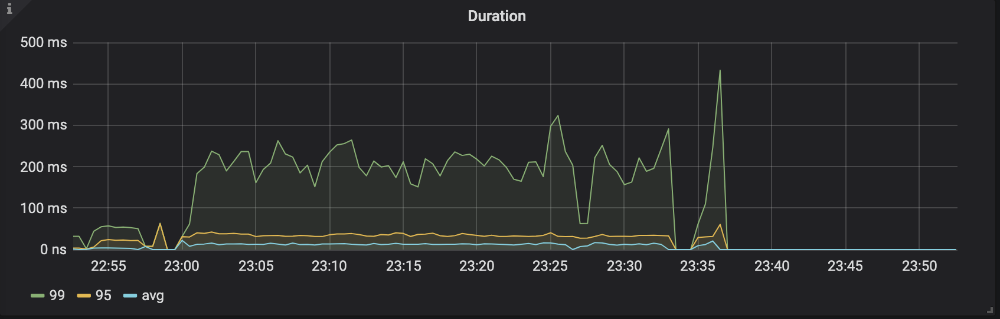
TiKV的cpu使用情况如下图：
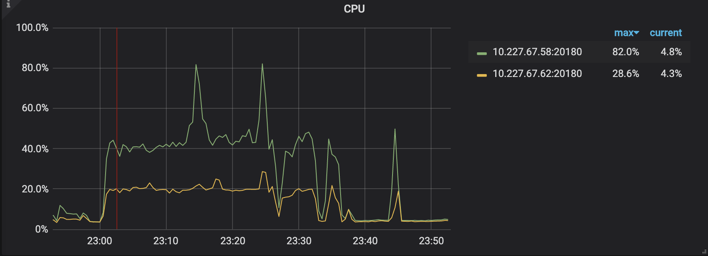
TiKV的qps如下图：
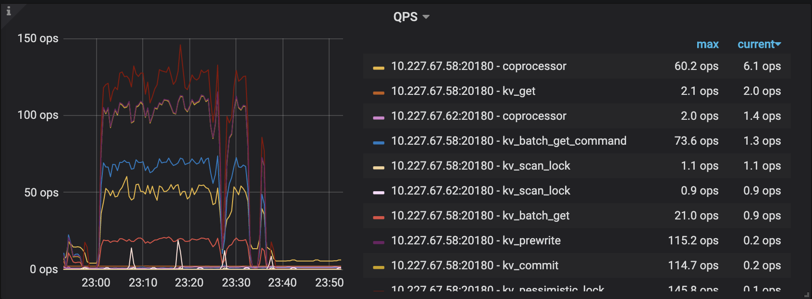
TiKV的grpc延迟如下图：
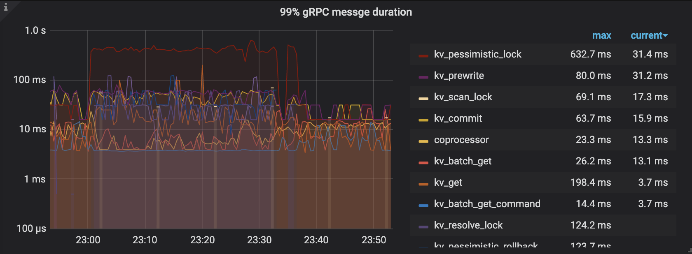
TiKV的grpc qps如下图：
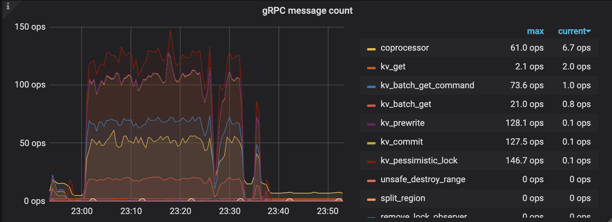

